<div align="center">

# 💊 Antigravity Token Capsule (监控胶囊)

**专为 Google Antigravity 打造的实时桌面悬浮 Token 监控与性能遥测伴生工具**

[ 简体中文 ] | [ English ](README_EN.md)

[](LICENSE)
[](#)
[](#)
[](#)
[](https://github.com/lzpgood123/antigravity-token-capsule/releases)

</div>

---

## 💡 为什么需要 Token Capsule？

在日常使用 **Google Antigravity** 进行高强度编码时，我们经常遇到这几个痛点：

1. **多 Agent 导致会话跳变**：当后台有子智能体、定时任务或并发任务运行时，常规的日志轮询工具会频繁在各个会话间来回乱跳，无法固定展示你当前屏幕上正在专注查看的会话。
2. **Token 消耗是一笔“糊涂账”**：界面上往往只展示一个总数字，你无法直观分辨到底是系统提示词占了大头，还是 MCP 外部服务、Agent 技能（Skills）或者冗长的对话历史吃掉了宝贵的上下文。
3. **真实生成性能难以感知**：大模型生成慢究竟是首字延迟（TTFT）高，还是流式传输速率（tok/s）低？
4. **财务成本缺乏即时反馈**：每次对话轮次实际花销多少、Prompt Cache 命中率能省下多少费用，缺乏直观的实时账单折算。

**Antigravity Token 监控胶囊** 正是为了彻底解决上述问题而设计的桌面伴生小工具。

---

## ✨ 核心特性

* 🎯 **CDP 独占锁定活跃会话 (Zero-Jitter Active Session Tracking)**  
  自动探测 Chromium `DevToolsActivePort` 端口，通过 Chrome DevTools 协议（CDP）实时捕获用户当前**前台聚焦的活跃会话 UUID**。后台并发再多 Agent 也绝不会引起界面跳变。
* 🧩 **五大 Token 分段构成 (5-Segment Context Breakdown)**  
  将单轮与全量会话上下文精准拆解为 5 项互不重叠的核心计量维度：
  * **System (系统提示词)**：底座指令与行为规范
  * **Tools (原生工具)**：内置 Native Tools 接口与参数定义
  * **Messages (对话消息)**：历史交互记录与工具执行结果
  * **MCP (外部扩展)**：通过 Model Context Protocol 挂载的外部服务
  * **Skills (专有技能)**：按需注入的 Agent Skills 框架上下文
* ⚡ **物理性能解码 (Real-Time Performance Telemetry)**  
  内置纯 Python 原生实现的无依赖 Protobuf 解码器，直接从 SQLite WAL 日志中提取 `gen_metadata` 二进制数据块，精确计算：
  * **TTFT (Time To First Token)**：首字响应延迟（毫秒级）
  * **Speed (tok/s)**：流式生成吞吐速率（当轮速度与全会话历史加权均值）
* 💰 **财务计费估算 (Cost & Cache Metering)**  
  实时统计未缓存 Prompt、生成 Candidate、Prompt Cache 缓存命中量及深度思考（Thinking）Token，换算美元开销并计算缓存命中收益率。
* 🎨 **5 套主题风格与桌面极简交互**  
  * 优雅的无边框半透明微型胶囊（药丸）造型，鼠标随心拖拽，点击一键展开/折叠详细卡片。
  * **5 套精美主题实时热切**：极简明亮、深邃暗夜、磨砂极光、赛博黑客、暖阳纸墨，自动持久化记忆。
  * **会话快速切换**：支持下拉历史会话快速复盘，或一键开启“自动跟随”。
  * **完善的系统托盘**：右键托盘支持开机自启（注册表托管）、窗口总在最前、位置重置（右上角）与安全退出。
* 📦 **免 Python 环境独立运行**  
  已预编译为独立单文件可执行文件（`token-capsule.exe`），无需安装 Python 或任何依赖，即拷即用。

---

## 🏛️ 系统工作原理

```mermaid
flowchart LR
    A[Antigravity 进程] -->|写入调试端口| B[DevToolsActivePort]
    B -->|HTTP /json 探针| C[CDP 嗅探器]
    C -->|提取前台聚焦会话 UUID| D[Active Session]
    D -->|300ms 只读无锁轮询| E[SQLite .db & .db-wal]
    E -->|读取 gen_metadata Blob| F[纯 Python Proto 解码器]
    F -->|解析 5 大分段 / TTFT / tok/s| G[数据引擎]
    G -->|Qt Signal/Slot| H[PySide6 桌面悬浮胶囊]
```



---

## 🚀 快速上手

### 方式 1：直接运行预编译单文件 EXE（最推荐）

1. 前往 [GitHub Releases](https://github.com/lzpgood123/antigravity-token-capsule/releases) 下载最新的 `token-capsule.exe`。
2. 双击直接运行。
3. 确保你的 Antigravity 客户端已启动，悬浮胶囊将会在毫秒级内自动吸附当前会话！

### 方式 2：Python 源码无控制台静默运行

适合想通过 Python 运行但不想看到 CMD 黑框的用户：
```cmd
tools\token-capsule\start_capsule_silent.vbs
```

### 方式 3：开发者控制台启动

适合进行二次开发或查看调试日志：
```cmd
tools\token-capsule\start_capsule.bat
```

---

## 🛠️ 源码开发与打包

### 1. 本地开发环境准备

推荐使用 Python 3.10+ 并创建独立虚拟环境：

```powershell
# 切换到工具目录
cd tools/token-capsule

# 创建并激活虚拟环境
python -m venv .venv
.\.venv\Scripts\Activate.ps1

# 安装依赖 (核心仅依赖 PySide6、PyInstaller 与 Pillow)
pip install -r requirements.txt
```

### 2. 运行源码

```powershell
python main.py
```

### 3. 一键编译打包为 EXE

仓库内已预置全自动化打包批处理脚本：

```cmd
build_exe.bat
```

打包脚本会自动生成高清胶囊应用图标（`capsule.ico`），并通过 PyInstaller 构建出两种产物：
* **单文件独立版**：`dist/onefile/token-capsule.exe`（便于独立分发，体积约 40MB，内嵌所有 Qt 运行时）
* **绿色目录版**：`dist/onedir/token-capsule/token-capsule.exe`（启动速度极致，毫秒级秒开）

---

## 🖥️ 核心代码架构

整个工具遵循**零耦合独立沙盒**原则，子目录完全自给自足：

```
tools/token-capsule/
├── main.py                   # Qt 应用程序主入口、托盘右键菜单与自启注册表管理
├── capsule_ui.py             # PySide6 悬浮胶囊窗体绘制、5套主题引擎与折叠卡片组件
├── data_engine.py            # CDP 探针、SQLite 只读轮询与指标聚合引擎
├── proto_decoder.py          # 纯 Python 独立 Protobuf 解码器 (零外部依赖)
├── generate_icon.py          # 自动渲染生成 capsule.ico 图标
├── build_exe.bat             # 一键 PyInstaller 双模式打包脚本
├── start_capsule.bat         # 控制台启动入口
├── start_capsule_silent.vbs  # 无黑框后台静默启动入口
├── requirements.txt          # Python 依赖清单
└── CONTEXT.md                # 领域概念术语字典
```

---

## ❓ 常见问题 (FAQ)

<details>
<summary><b>Q1: 为什么启动后显示 "等待 Antigravity..."？</b></summary>
答：胶囊需要通过 <code>~/AppData/Roaming/Antigravity/DevToolsActivePort</code> 连接调试接口。请先打开 Google Antigravity 客户端，胶囊检测到活动端口后会自动建立连接并读取数据。
</details>

<details>
<summary><b>Q2: 读取 SQLite 数据库会导致 Antigravity 读写锁死或崩溃吗？</b></summary>
答：绝对不会。本工具使用 URI 模式的只读连接（<code>?mode=ro</code>），并且只在检测到 <code>.db-wal</code> 文件修改时间发生变化时轻量读取，不会对 Antigravity 正常的读写写入产生任何互斥锁，资源占用极低。
</details>

<details>
<summary><b>Q3: 开机自启是如何实现的？写入了哪里？</b></summary>
答：通过系统托盘菜单勾选“开机自动启动”，会在当前用户的 Windows 注册表项 <code>HKCU\Software\Microsoft\Windows\CurrentVersion\Run</code> 中安全登记当前程序路径，不修改系统保护目录，不写入管理员权限注册表。
</details>

<details>
<summary><b>Q4: 窗口拖到屏幕外面找不到了怎么办？</b></summary>
答：右键系统右下角托盘图标，点击 **「重置位置到右上角」** 即可瞬间归位。
</details>

---

## 📄 开源许可证

本项目基于 [MIT License](LICENSE) 开源发布。
