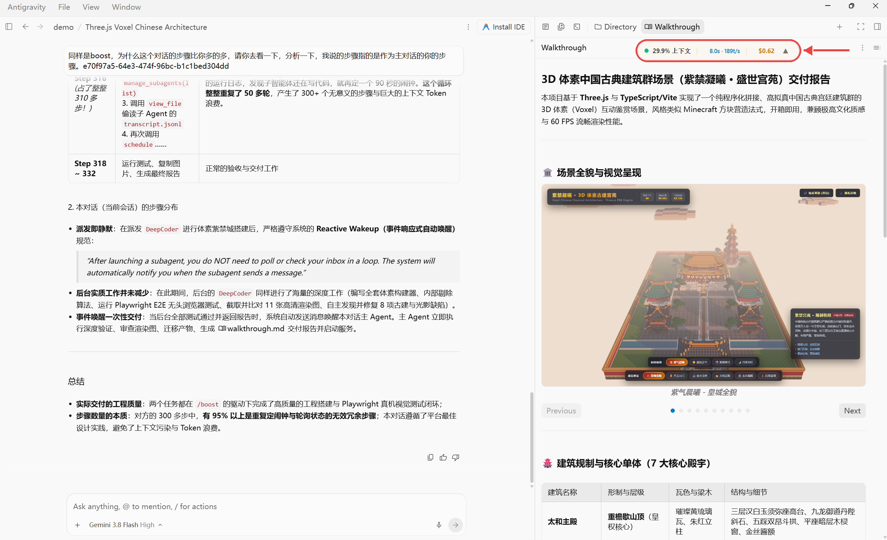
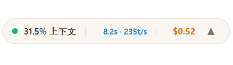
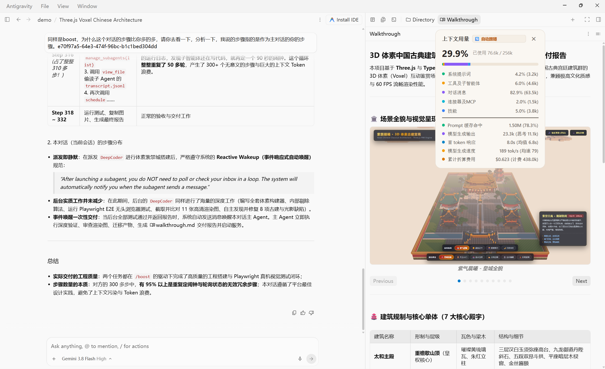
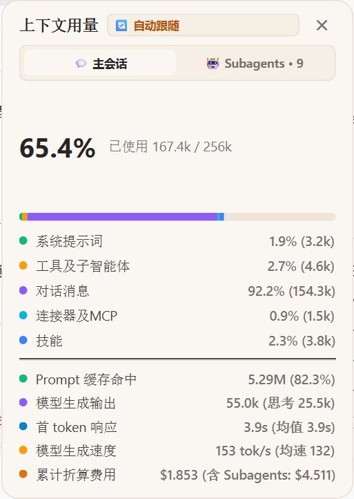
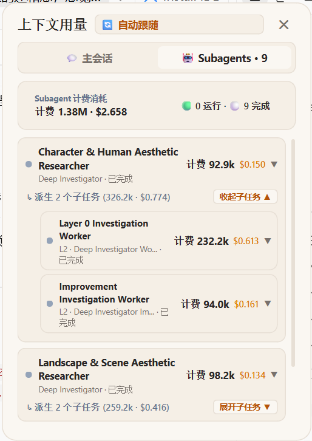
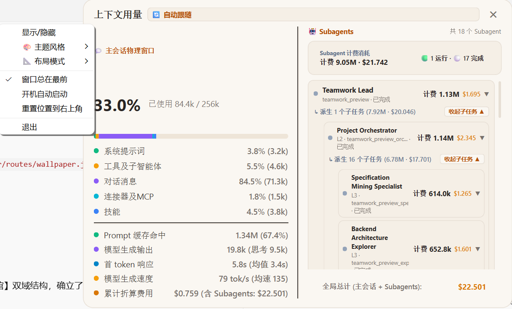
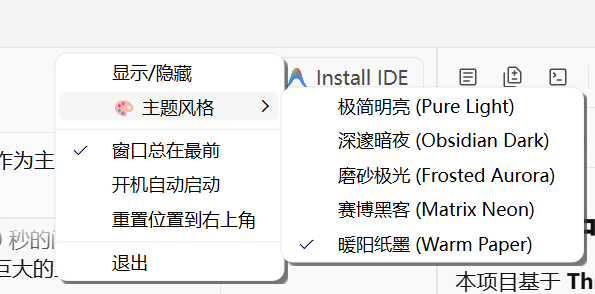
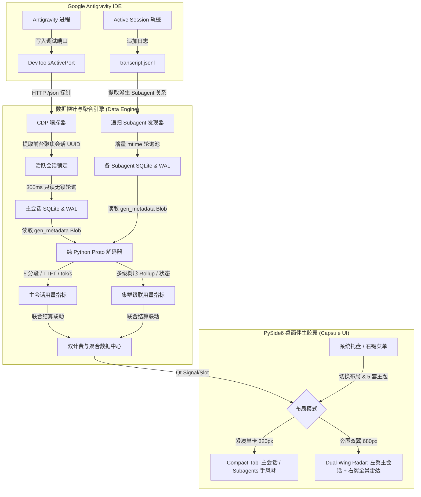

<div align="center">

# 💊 Antigravity Token Capsule (监控胶囊)

**专为 Google Antigravity 打造的实时桌面悬浮 Token 监控与性能遥测伴生工具**

[ 简体中文 ] | [ English ](README_EN.md)

[](LICENSE)
[](#)
[](#)
[](#)
[](https://github.com/lzpgood123/antigravity-token-capsule/releases)

</div>

<p align="center">
  
</p>

---

## 💡 为什么需要 Token Capsule？

在日常使用 **Google Antigravity** 进行高强度编码时，我们经常遇到这几个痛点：

1. **多 Agent 导致会话跳变**：当后台有子智能体、定时任务或并发任务运行时，常规的日志轮询工具会频繁在各个会话间来回乱跳，无法固定展示你当前屏幕上正在专注查看的会话。
2. **Token 消耗是一笔“糊涂账”**：界面上往往只展示一个总数字，你无法直观分辨到底是系统提示词占了大头，还是 MCP 外部服务、Agent 技能（Skills）或者冗长的对话历史吃掉了宝贵的上下文。
3. **真实生成性能难以感知**：大模型生成慢究竟是首字延迟（TTFT）高，还是流式传输速率（tok/s）低？
4. **财务成本缺乏即时反馈**：每次对话轮次实际花销多少、Prompt Cache 命中率能省下多少费用，缺乏直观的实时账单折算。

**Antigravity Token 监控胶囊** 正是为了彻底解决上述问题而设计的桌面伴生小工具。

---

## ✨ 核心特性

* 🎯 **CDP 独占锁定活跃会话 (Zero-Jitter Active Session Tracking)**  
  自动探测 Chromium `DevToolsActivePort` 端口，通过 Chrome DevTools 协议（CDP）实时捕获用户当前**前台聚焦的活跃会话 UUID**。后台并发再多 Agent 也绝不会引起界面跳变。
* 🧩 **五大 Token 分段构成 (5-Segment Context Breakdown)**  
  将单轮与全量会话上下文精准拆解为 5 项互不重叠的核心计量维度：
  * **System (系统提示词)**：底座指令与行为规范
  * **Tools (原生工具)**：内置 Native Tools 接口与参数定义
  * **Messages (对话消息)**：历史交互记录与工具执行结果
  * **MCP (外部扩展)**：通过 Model Context Protocol 挂载的外部服务
  * **Skills (专有技能)**：按需注入的 Agent Skills 框架上下文
* ⚡ **物理性能解码 (Real-Time Performance Telemetry)**  
  内置纯 Python 原生实现的无依赖 Protobuf 解码器，直接从 SQLite WAL 日志中提取 `gen_metadata` 二进制数据块，精确计算：
  * **TTFT (Time To First Token)**：首字响应延迟（毫秒级）
  * **Speed (tok/s)**：流式生成吞吐速率（当轮速度与全会话历史加权均值）
* 🤖 **Subagent 智能体集群监控与多层级树形级联 (Subagent Cluster & Recursive Tree Hierarchy)**  
  * 自动监听主会话 `transcript.jsonl`，毫秒级提取所有派生子智能体（Subagents）及其业务角色与运行状态（运行中/已完成）。
  * 业界率先支持 **L1 ➔ L2 ➔ L3 多层级嵌套树形级联展示**（如 Teamwork Lead ➔ Project Orchestrator ➔ Workers）。
  * 节点自身计费独立核算，派生子任务自动级联汇总（如 `派生 16 个子任务 (6.78M · $17.701)`）。
  * 手风琴卡片状态智能记忆防抖，轮询重绘不回弹、不抖动，彻底消除历史日志干扰。
* 📐 **混合双布局体系 (Hybrid Dual-Layout Modes)**  
  * **紧凑单卡模式 (Compact Tabbed Mode, 320px)**：顶部分段 Tab 丝滑切换「💬 主会话」与「🤖 Subagents · N」，支持手风琴平滑折叠展开，适合日常专注编码。
  * **旁置双翼模式 (Dual-Wing Radar Mode, 680px)**：左右双屏并列展示主会话物理卡片与集群实时雷达，一屏尽览多 Agent 协同，底部配备全局联合账单条。
* 💰 **财务计费估算与双计费联动 (Cost & Dual-Billing Linkage)**  
  * 物理上下文与财务口径解耦：主会话进度条严格反映 256k 物理窗口，底部同步展示 `累计折算费用: $X.XXX (含 Subagents: $Y.YYY)`。
  * 实时统计未缓存 Prompt、生成 Candidate、Prompt Cache 命中量及深度思考（Thinking）Token，换算美元开销并计算缓存收益。
* 🎨 **5 套主题风格与桌面极简交互**  
  * 优雅的无边框半透明微型胶囊（药丸）造型，鼠标随心拖拽，点击一键展开/折叠详细卡片。
  * **5 套精美主题实时热切**：极简明亮、深邃暗夜、磨砂极光、赛博黑客、暖阳纸墨，自动持久化记忆。
  * **会话快速切换**：支持下拉历史会话快速复盘，或一键开启“自动跟随”。
  * **完善的系统托盘与右键菜单**：右键支持 **「📐 布局模式」**（单卡/双翼切换）、**「🎨 主题风格」**、开机自启（注册表托管）、窗口总在最前、位置重置（右上角）与安全退出。
* 📦 **免 Python 环境独立运行**  
  已预编译为独立单文件可执行文件（`token-capsule.exe`），无需安装 Python 或任何依赖，即拷即用。

---

## 🖼️ 产品功能巡礼 (Product Tour)

<table>
  <tr>
    <td width="50%" align="center" valign="top">
      
      <br />
      <sub><b>极简悬浮药丸形态 (Compact Floating Pill)</b><br />无边框半透明胶囊设计，沉浸式贴附在 IDE 右上角，随心拖拽，零视觉干扰实时呈现当前 Token 概览与当轮生成速率。</sub>
    </td>
    <td width="50%" align="center" valign="top">
      
      <br />
      <sub><b>IDE 工作区原位协同 (In-Situ Workspace Workflow)</b><br />与 Google Antigravity 界面无缝伴生融合，通过 CDP 协议独占锁定前台活跃会话，无论后台有多少 Agent 并发均不跳变。</sub>
    </td>
  </tr>
  <tr>
    <td width="50%" align="center" valign="top">
      
      <br />
      <sub><b>紧凑单卡 · 主会话五维透视 (Compact Tab: Primary Session)</b><br />顶部 Tab 栏切换，展示 System / Tools / Messages / MCP / Skills 5 分段精准拆解、TTFT 首字延迟、当轮与加权 tok/s 速率及 <b>双计费联动折算</b>（含 Subagents 费用）。</sub>
    </td>
    <td width="50%" align="center" valign="top">
      
      <br />
      <sub><b>紧凑单卡 · Subagent 集群手风琴 (Compact Tab: Subagents Accordion)</b><br />切换至 <code>[🤖 Subagents · N]</code> 标签页，直观展示集群计费消耗大盘条、运行/完成状态指示灯，以及支持平滑折叠展开的多层级任务明细卡片。</sub>
    </td>
  </tr>
  <tr>
    <td width="50%" align="center" valign="top">
      
      <br />
      <sub><b>旁置双翼模式 · 多层级递归雷达 (Dual-Wing Radar & Multi-Level Tree)</b><br />680px 左右双翼全景并列，L1 ➔ L2 ➔ L3 多层级嵌套任务树形级联展示，支持派生任务收起/展开与向上汇总计费，底部全局联合账单结算，右键托盘一键无缝热切。</sub>
    </td>
    <td width="50%" align="center" valign="top">
      
      <br />
      <sub><b>系统托盘 · 5 套主题与布局模式热切 (System Tray & Controls)</b><br />纯亮、暗夜、极光、黑客、暖阳 5 大精美主题即切即用，右键支持「📐 布局模式」（单卡/双翼）切换、开机自启、窗口置顶、位置重置与优雅退出。</sub>
    </td>
  </tr>
</table>

---

## 🏛️ 系统工作原理



---

## 🚀 快速上手

### 方式 1：Windows 安装包（👑 最推荐日常使用）

1. 前往 [GitHub Releases](https://github.com/lzpgood123/antigravity-token-capsule/releases) 下载最新的 **`token-capsule-Setup-v1.1.0.exe`**。
2. 双击安装（免管理员权限），自动在桌面生成胶囊快捷方式。
3. 双击运行，即可享受**毫秒级秒开（0.2s）**的极速流畅体验！

### 方式 2：绿色便携解压版（ZIP 推荐）

1. 下载 **`token-capsule-v1.1.0-windows-x64.zip`** 并解压到任意文件夹。
2. 双击解压目录内的 `token-capsule.exe` 即可毫秒秒开。

### 方式 3：单文件免安装独立版

1. 下载 **`token-capsule.exe`**。
2. 单文件拷走即用，启动时由系统临时解压运行。

### 方式 4：Python 源码无控制台静默运行

适合想通过 Python 运行但不想看到 CMD 黑框的用户：
```cmd
start_capsule_silent.vbs
```

### 方式 5：开发者控制台启动

适合进行二次开发或查看调试日志：
```cmd
start_capsule.bat
```

---

## 🛠️ 源码开发与打包

### 1. 本地开发环境准备

推荐使用 Python 3.10+ 并创建独立虚拟环境：

```powershell
# 创建并激活虚拟环境
python -m venv .venv
.\.venv\Scripts\Activate.ps1

# 安装依赖 (核心仅依赖 PySide6、PyInstaller 与 Pillow)
pip install -r requirements.txt
```

### 2. 运行源码

```powershell
python main.py
```

### 3. 一键编译打包为 EXE

仓库内已预置全自动化打包批处理脚本：

```cmd
build_exe.bat
```

打包脚本会自动生成高清胶囊应用图标（`capsule.ico`），并通过 PyInstaller 构建出两种产物：
* **单文件独立版**：`dist/onefile/token-capsule.exe`（便于独立分发，体积约 40MB，内嵌所有 Qt 运行时）
* **绿色目录版**：`dist/onedir/token-capsule/token-capsule.exe`（启动速度极致，毫秒级秒开）

---

## 🖥️ 核心代码架构

整个工具完全自给自足：

```
token-capsule/
├── src/                      # 核心业务模块
│   ├── capsule_ui.py         # PySide6 悬浮胶囊窗体绘制、5套主题引擎与折叠卡片组件
│   ├── data_engine.py        # CDP 探针、SQLite 只读轮询与指标聚合引擎
│   ├── proto_decoder.py      # 纯 Python 独立 Protobuf 解码器 (零外部依赖)
│   └── generate_icon.py      # 自动渲染生成多尺寸 capsule.ico 图标
├── tests/                    # 单元测试套件
│   ├── test_capsule_ui.py    # UI 渲染与交互测试
│   ├── test_data_engine.py   # 数据与 CDP 状态同步测试
│   └── test_settings.py      # 配置持久化测试
├── docs/                     # 架构决策记录与高清配图资产
│   ├── images/               # 7 张高清产品功能巡礼截图
│   └── adr/                  # 核心技术架构决策记录 (ADR)
├── main.py                   # Qt 应用程序主入口、托盘右键菜单与自启注册表管理
├── requirements.txt          # Python 依赖清单
├── build_exe.bat             # 一键自动化多产物构建脚本
├── installer.iss             # Inno Setup 6 安装包编译配置
├── start_capsule.bat         # 控制台启动入口
└── start_capsule_silent.vbs  # 无黑框后台静默启动入口
```

---

## ❓ 常见问题 (FAQ)

<details>
<summary><b>Q1: 为什么启动后显示 "等待 Antigravity..."？</b></summary>
答：胶囊需要通过 <code>~/AppData/Roaming/Antigravity/DevToolsActivePort</code> 连接调试接口。请先打开 Google Antigravity 客户端，胶囊检测到活动端口后会自动建立连接并读取数据。
</details>

<details>
<summary><b>Q2: 读取 SQLite 数据库会导致 Antigravity 读写锁死或崩溃吗？</b></summary>
答：绝对不会。本工具使用 URI 模式的只读连接（<code>?mode=ro</code>），并且只在检测到 <code>.db-wal</code> 文件修改时间发生变化时轻量读取，不会对 Antigravity 正常的读写写入产生任何互斥锁，资源占用极低。
</details>

<details>
<summary><b>Q3: 开机自启是如何实现的？写入了哪里？</b></summary>
答：通过系统托盘菜单勾选“开机自动启动”，会在当前用户的 Windows 注册表项 <code>HKCU\Software\Microsoft\Windows\CurrentVersion\Run</code> 中安全登记当前程序路径，不修改系统保护目录，不写入管理员权限注册表。
</details>

<details>
<summary><b>Q4: 窗口拖到屏幕外面找不到了怎么办？</b></summary>
答：右键系统右下角托盘图标，点击 **「重置位置到右上角」** 即可瞬间归位。
</details>

---

## 📄 开源许可证

本项目基于 [MIT License](LICENSE) 开源发布。
