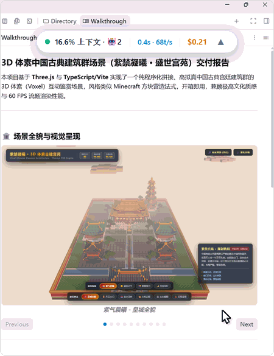
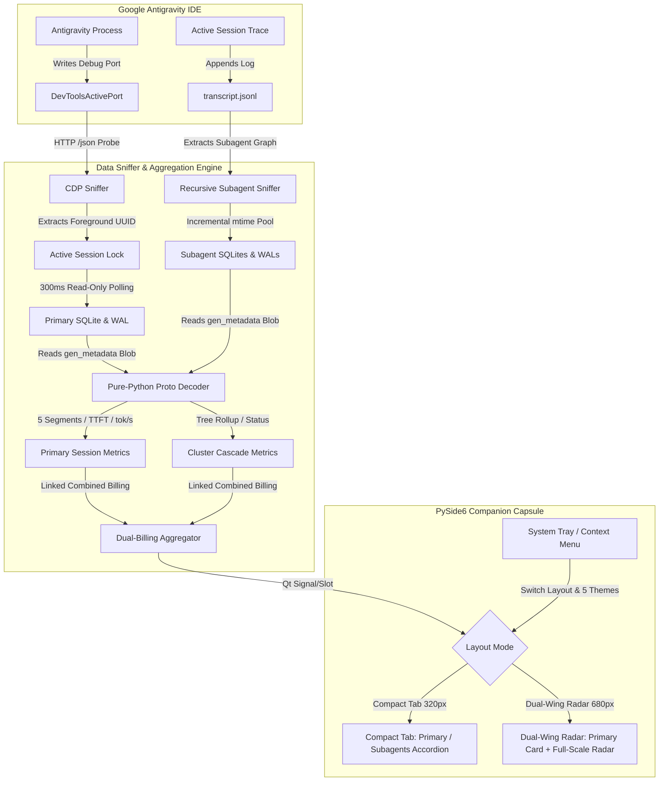

<div align="center">

# 💊 Antigravity Token Capsule

**Real-time Desktop Floating Token Monitor & Performance Telemetry Companion for Google Antigravity**

[ 简体中文 ](README.md) | [ English ]

[](LICENSE)
[](#)
[](#)
[](#)
[](https://github.com/lzpgood123/antigravity-token-capsule/releases)

</div>

<p align="center">
  
  <br />
  <em>🎬 8-Second Interactive Demo: Pill Mode ➔ In-situ Expansion ➔ Subagent Cluster Tree ➔ Cyberpunk Neon ➔ Seamless Loop</em>
</p>

<p align="center">
  
</p>

---

## 💡 Why Token Capsule?

When developing with **Google Antigravity**, developers frequently encounter these pain points:

1. **Session Jitter from Background Agents**: Standard polling tools constantly flip between conversations whenever background subagents or cron jobs run, making it impossible to stay focused on the session you are actually reading.
2. **Opaque Token Usage**: The client only displays a single cumulative token number. You cannot easily tell whether system prompts, external MCP tools, agent skills, or historical conversation messages are devouring your context window.
3. **Inaccessible Physical Performance Metrics**: When a model feels slow, is it due to a high Time-To-First-Token (TTFT) or low streaming generation throughput (`tok/s`)?
4. **No Real-Time Cost Transparency**: You have no immediate feedback on turn-by-turn costs or how much budget is being saved by Prompt Caching.

**Antigravity Token Capsule** was built to address these exact problems cleanly with zero overhead.

---

## ✨ Core Features

* 🎯 **Zero-Jitter Active Session Tracking via CDP**  
  Automatically detects Chromium's `DevToolsActivePort` and communicates via the Chrome DevTools Protocol (CDP) to track **only the active conversation currently in the foreground**. Even with dozens of background agents working concurrently, your monitoring capsule never jitters.
* 🧩 **5-Segment Context Breakdown**  
  Decomposes total context tokens into five non-overlapping segments:
  * **System**: Core system prompts and base instructions
  * **Tools**: Native API definitions and tool schemas
  * **Messages**: Historical chat turns and tool execution outputs
  * **MCP**: External tools declared via Model Context Protocol servers
  * **Skills**: Injected agent skill contexts
* ⚡ **Zero-Dependency Protobuf Decoding (TTFT & tok/s)**  
  Ships with a pure-Python Protobuf parser that directly decodes `gen_metadata` blobs from SQLite WAL logs without external dependencies:
  * **TTFT (Time To First Token)**: Millisecond-level first-token response latency
  * **Speed (tok/s)**: Streaming generation throughput (both current turn and historical weighted average)
* 🤖 **Subagent Cluster Telemetry & Recursive Tree Hierarchy**  
  * Automatically sniffs `transcript.jsonl` to extract child Subagents with their semantic role names and live status (`running` / `completed`).
  * Industry-first support for **L1 ➔ L2 ➔ L3 multi-level recursive tree cascades** (e.g., Teamwork Lead ➔ Project Orchestrator ➔ Workers).
  * Node-level independent billing plus automatic descendant rollup (e.g., `Derived 16 subtasks (6.78M · $17.701)`).
  * Persistent accordion state memory across polling cycles—zero jitter, no involuntary collapse, and complete isolation from stale historical sessions.
* 📐 **Hybrid Dual-Layout Modes**  
  * **Compact Tabbed Mode (320px)**: Top segmented tabs to switch seamlessly between `[💬 Primary Session]` and `[🤖 Subagents · N]` with smooth collapsible accordion cards for distraction-free coding.
  * **Dual-Wing Radar Mode (680px)**: Side-by-side panoramic split view displaying the primary session card on the left and full-scale subagent cluster radar on the right, complete with a global combined billing bar.
* 💰 **Cost Metering & Dual-Billing Linkage (Gemini 3.8 Flash Baseline)**  
  * **Authoritative Baseline Model**: Dollar conversions strictly adhere to **Google Gemini 3.8 Flash** official pricing:
    | Dimension | Rate | Description |
    | :--- | :--- | :--- |
    | **Input (Prompt)** | **$0.75 / 1M tokens** | Uncached turn prompt tokens |
    | **Output (Candidate)** | **$3.75 / 1M tokens** | Generated thinking and response tokens |
    | **Cache Hit (Prompt Cache)** | **$0.15 / 1M tokens** | Context caching discount saving compute cost |
  * **Dual-Billing Linkage**: The progress bar strictly tracks the active 256k physical window, while the card displays `Total Cost (Gemini 3.8 Flash): $X.XXX (incl. Subagents: $Y.YYY)` with transparent hover tooltips.
* ⚡ **Context Auto-Compaction Telemetry**  
  * Sniffs `type: "CHECKPOINT"` truncation markers from conversation logs to count the exact number of times historical context has been auto-summarized by Antigravity.
  * **Hero Badge Alert**: A vibrant orange badge (e.g., `⚡ 压缩 2 次`) appears next to the core percentage whenever context compaction occurs (`>= 1`), accompanied by an explicit `Context Auto-Compaction` summary metric.
* 🎨 **5 Beautiful Built-in Themes & Modern Desktop UX**  
  * Ultra-compact frameless pill shape with smooth mouse dragging and one-click card expansion.
  * **5 live-switchable themes**: Pure Light, Obsidian Dark, Frosted Aurora, Matrix Neon, and Warm Paper (persisted across restarts).
  * **Session Quick Switching**: Dropdown menu to inspect recent conversations or lock onto Auto-Follow.
  * **Comprehensive System Tray & Context Menu**: Right-click to switch **「📐 Layout Mode」** (Compact Tab / Dual-Wing Radar), cycle **「🎨 Themes」**, toggle Windows startup (HKCU registry), keep window always-on-top, reset position to the top-right corner, or exit cleanly.
* 📦 **Standalone Windows Executable**  
  Ships as a pre-compiled standalone binary (`token-capsule.exe`). No Python runtime or package installation required.

---

## 🖼️ Product Tour

<table>
  <tr>
    <td width="50%" align="center" valign="top">
      
      <br />
      <sub><b>Ultra-Compact Floating Pill</b><br />Frameless, translucent floating widget docked unobtrusively in your workspace. Drag anywhere with zero clutter while tracking active session tokens and streaming throughput.</sub>
    </td>
    <td width="50%" align="center" valign="top">
      
      <br />
      <sub><b>In-Situ Antigravity Workspace Integration</b><br />Seamless companion experience floating alongside active agent workflows, locked to your foreground conversation via CDP without session jumping.</sub>
    </td>
  </tr>
  <tr>
    <td width="50%" align="center" valign="top">
      
      <br />
      <sub><b>Compact Tab · Primary Session Telemetry (5-Segment Breakdown)</b><br />Segmented tab bar navigation detailing System / Tools / Messages / MCP / Skills breakdown, TTFT latency, streaming tok/s, and <b>linked dual-billing rollups</b> (including Subagent expenditures).</sub>
    </td>
    <td width="50%" align="center" valign="top">
      
      <br />
      <sub><b>Compact Tab · Subagents Cluster Accordion</b><br />Switch to the <code>[🤖 Subagents · N]</code> tab for a cluster summary header, active/completed status indicators, and smooth multi-level collapsible task detail cards.</sub>
    </td>
  </tr>
  <tr>
    <td width="50%" align="center" valign="top">
      
      <br />
      <sub><b>Dual-Wing Radar Mode · Multi-Level Recursive Tree</b><br />680px panoramic side-by-side layout displaying L1 ➔ L2 ➔ L3 recursive task hierarchy, expandable child tasks with rollup cost rollups, combined global billing, and instant tray switching.</sub>
    </td>
    <td width="50%" align="center" valign="top">
      
      <br />
      <sub><b>System Tray Menu · 5 Themes & Layout Switcher</b><br />Instant hot-switching across 5 curated themes (Pure Light, Obsidian Dark, Frosted Aurora, Matrix Neon, Warm Paper), layout mode toggle (Single / Dual-Wing), autostart, window pinning, and position reset.</sub>
    </td>
  </tr>
</table>

---

## 🏛️ Architecture & Workflow



---

## 🚀 Quick Start

### Method 1: Windows Installer (👑 Recommended)

1. Download **`token-capsule-Setup-v1.1.0.exe`** from [GitHub Releases](https://github.com/lzpgood123/antigravity-token-capsule/releases).
2. Double-click to install (no administrator rights needed). Automatically generates desktop and start menu shortcuts.
3. Launch and enjoy **millisecond-level instant startup (0.2s)**!

### Method 2: Portable Green ZIP Package (Instant Launch)

1. Download **`token-capsule-v1.1.0-windows-x64.zip`** and extract to any directory.
2. Double-click `token-capsule.exe` inside the extracted folder for instant launch.

### Method 3: Standalone Single-File EXE

1. Download **`token-capsule.exe`**.
2. Run directly with zero dependencies (has ~2s self-extraction delay on first boot).

### Method 4: Silent Background Launch (Python Source)

If you have Python installed and want to run silently without an open terminal window:
```cmd
start_capsule_silent.vbs
```

### Method 5: Standard Console Launch (For Development)

If you want to view terminal logs while debugging:
```cmd
start_capsule.bat
```

---

## 🛠️ Development & Building from Source

### 1. Setup Environment

Python 3.10+ is recommended:

```powershell
# Create and activate virtual environment
python -m venv .venv
.\.venv\Scripts\Activate.ps1

# Install dependencies (only PySide6, PyInstaller, and Pillow)
pip install -r requirements.txt
```

### 2. Run from Source

```powershell
python main.py
```

### 3. Build Standalone Executable

Run the automated build script:

```cmd
build_exe.bat
```

This compiles two distribution targets:
* **Single-file Portable EXE**: `dist/onefile/token-capsule.exe` (~40MB, fully bundled with Qt runtime)
* **Directory EXE**: `dist/onedir/token-capsule/token-capsule.exe` (lightning-fast cold start)

---

## 🖥️ Repository Layout

The tool follows a self-contained layout:

```
token-capsule/
├── src/                      # Core business modules
│   ├── capsule_ui.py         # PySide6 floating window, 5-theme engine & foldable cards
│   ├── data_engine.py        # CDP sniffer, SQLite WAL polling & telemetry engine
│   ├── proto_decoder.py      # Pure Python zero-dependency Protobuf decoder
│   └── generate_icon.py      # Multi-resolution capsule.ico generation script
├── tests/                    # Unit test suite
│   ├── test_capsule_ui.py    # UI rendering & mouse interaction tests
│   ├── test_data_engine.py   # CDP sniffer & SQLite usage tests
│   └── test_settings.py      # Settings persistence tests
├── docs/                     # Documentation & visual assets
│   ├── images/               # High-res tour screenshots
│   └── adr/                  # Architectural Decision Records (ADR)
├── main.py                   # Application entry point, tray menu & autostart registry
├── requirements.txt          # Python dependencies
├── build_exe.bat             # Automated multi-target packaging script
├── installer.iss             # Inno Setup 6 installer script
├── start_capsule.bat         # Console startup script
└── start_capsule_silent.vbs  # Silent VBS startup launcher
```

---

## ❓ FAQ

<details>
<summary><b>Q1: Why does the widget say "Waiting for Antigravity..." on startup?</b></summary>
Answer: The capsule reads <code>~/AppData/Roaming/Antigravity/DevToolsActivePort</code> to establish its connection. Please make sure Google Antigravity is running. As soon as the active port is detected, the capsule binds immediately.
</details>

<details>
<summary><b>Q2: Will reading SQLite files cause database lockups or crash Antigravity?</b></summary>
Answer: No. Connections are made in read-only URI mode (<code>?mode=ro</code>) and only query when the <code>.db-wal</code> modification timestamp changes. This introduces zero locking conflicts with Antigravity's ongoing writes and consumes virtually 0% CPU.
</details>

<details>
<summary><b>Q3: How does Windows autostart work?</b></summary>
Answer: Toggling "Start on Boot" in the tray menu writes the program path safely to <code>HKCU\Software\Microsoft\Windows\CurrentVersion\Run</code>. It requires no administrator privileges and does not alter system files.
</details>

<details>
<summary><b>Q4: What should I do if the capsule is dragged off-screen?</b></summary>
Answer: Right-click the system tray icon in your Windows taskbar and click **"Reset Position to Top-Right"**.
</details>

---

## 📄 License

Distributed under the [MIT License](LICENSE).
