<div align="center">

# 💊 Antigravity Token Capsule

**Real-time Desktop Floating Token Monitor & Performance Telemetry Companion for Google Antigravity**

[ 简体中文 ](README.md) | [ English ]

[](LICENSE)
[](#)
[](#)
[](#)
[](https://github.com/lzpgood123/antigravity-token-capsule/releases)

</div>

<p align="center">
  
</p>

---

## 💡 Why Token Capsule?

When developing with **Google Antigravity**, developers frequently encounter these pain points:

1. **Session Jitter from Background Agents**: Standard polling tools constantly flip between conversations whenever background subagents or cron jobs run, making it impossible to stay focused on the session you are actually reading.
2. **Opaque Token Usage**: The client only displays a single cumulative token number. You cannot easily tell whether system prompts, external MCP tools, agent skills, or historical conversation messages are devouring your context window.
3. **Inaccessible Physical Performance Metrics**: When a model feels slow, is it due to a high Time-To-First-Token (TTFT) or low streaming generation throughput (`tok/s`)?
4. **No Real-Time Cost Transparency**: You have no immediate feedback on turn-by-turn costs or how much budget is being saved by Prompt Caching.

**Antigravity Token Capsule** was built to address these exact problems cleanly with zero overhead.

---

## ✨ Core Features

* 🎯 **Zero-Jitter Active Session Tracking via CDP**  
  Automatically detects Chromium's `DevToolsActivePort` and communicates via the Chrome DevTools Protocol (CDP) to track **only the active conversation currently in the foreground**. Even with dozens of background agents working concurrently, your monitoring capsule never jitters.
* 🧩 **5-Segment Context Breakdown**  
  Decomposes total context tokens into five non-overlapping segments:
  * **System**: Core system prompts and base instructions
  * **Tools**: Native API definitions and tool schemas
  * **Messages**: Historical chat turns and tool execution outputs
  * **MCP**: External tools declared via Model Context Protocol servers
  * **Skills**: Injected agent skill contexts
* ⚡ **Zero-Dependency Protobuf Decoding (TTFT & tok/s)**  
  Ships with a pure-Python Protobuf parser that directly decodes `gen_metadata` blobs from SQLite WAL logs without external dependencies:
  * **TTFT (Time To First Token)**: Millisecond-level first-token response latency
  * **Speed (tok/s)**: Streaming generation throughput (both current turn and historical weighted average)
* 💰 **Turn & Cumulative Cost Metering**  
  Tracks prompt tokens, candidate tokens, Prompt Cache hits, and deep thinking tokens in real time, calculating actual dollar costs and cache hit savings.
* 🎨 **5 Beautiful Built-in Themes & Modern Desktop UX**  
  * Ultra-compact frameless pill shape with smooth mouse dragging and one-click card expansion.
  * **5 live-switchable themes**: Pure Light, Obsidian Dark, Frosted Aurora, Matrix Neon, and Warm Paper (persisted across restarts).
  * **Session Quick Switching**: Dropdown menu to inspect recent conversations or lock onto Auto-Follow.
  * **System Tray Ecosystem**: Right-click tray icon to toggle Windows startup (HKCU registry), keep window always-on-top, reset position to the top-right corner, or exit cleanly.
* 📦 **Standalone Windows Executable**  
  Ships as a pre-compiled standalone binary (`token-capsule.exe`). No Python runtime or package installation required.

---

## 🖼️ Product Tour

<table>
  <tr>
    <td width="50%" align="center" valign="top">
      
      <br />
      <sub><b>Ultra-Compact Floating Pill</b><br />Frameless, translucent floating widget docked unobtrusively in your workspace. Drag anywhere with zero clutter while tracking active session tokens and streaming throughput.</sub>
    </td>
    <td width="50%" align="center" valign="top">
      
      <br />
      <sub><b>5-Segment Telemetry & Cost Breakdown Card</b><br />Click to expand in-depth telemetry: exact breakdown across System, Tools, Messages, MCP, and Skills, alongside TTFT latency, streaming tok/s, and real-time dollar cost metering.</sub>
    </td>
  </tr>
  <tr>
    <td width="50%" align="center" valign="top">
      
      <br />
      <sub><b>In-Situ Antigravity Workspace Integration</b><br />Seamless companion experience floating alongside active agent workflows, locked to your foreground conversation via CDP without session jumping.</sub>
    </td>
    <td width="50%" align="center" valign="top">
      
      <br />
      <sub><b>System Tray Menu & 5-Theme Switcher</b><br />Hot-switch instantly across 5 curated themes (Pure Light, Obsidian Dark, Frosted Aurora, Matrix Neon, Warm Paper) with startup toggle, window pinning, and quick position reset.</sub>
    </td>
  </tr>
</table>

---

## 🏛️ Architecture & Workflow

```mermaid
flowchart LR
    A[Antigravity Process] -->|Writes Debug Port| B[DevToolsActivePort]
    B -->|HTTP /json Probe| C[CDP Sniffer]
    C -->|Extracts Foreground UUID| D[Active Session]
    D -->|300ms Read-Only Polling| E[SQLite .db & .db-wal]
    E -->|Extracts gen_metadata Blob| F[Pure-Python Proto Decoder]
    F -->|Computes 5 Segments / TTFT / tok/s| G[Data Engine]
    G -->|Qt Signal/Slot| H[PySide6 Floating Capsule]
```



---

## 🚀 Quick Start

### Method 1: Pre-Built Standalone EXE (Recommended)

1. Download the latest `token-capsule.exe` from [GitHub Releases](https://github.com/lzpgood123/antigravity-token-capsule/releases).
2. Double-click to launch.
3. Keep Google Antigravity open. The capsule will lock onto your active session within milliseconds.

### Method 2: Silent Background Launch (Python Source)

If you have Python installed and want to run silently without an open terminal window:
```cmd
tools\token-capsule\start_capsule_silent.vbs
```

### Method 3: Standard Console Launch (For Development)

If you want to view terminal logs while debugging:
```cmd
tools\token-capsule\start_capsule.bat
```

---

## 🛠️ Development & Building from Source

### 1. Setup Environment

Python 3.10+ is recommended:

```powershell
# Navigate to tool directory
cd tools/token-capsule

# Create and activate virtual environment
python -m venv .venv
.\.venv\Scripts\Activate.ps1

# Install dependencies (only PySide6, PyInstaller, and Pillow)
pip install -r requirements.txt
```

### 2. Run from Source

```powershell
python main.py
```

### 3. Build Standalone Executable

Run the automated build script:

```cmd
build_exe.bat
```

This compiles two distribution targets:
* **Single-file Portable EXE**: `dist/onefile/token-capsule.exe` (~40MB, fully bundled with Qt runtime)
* **Directory EXE**: `dist/onedir/token-capsule/token-capsule.exe` (lightning-fast cold start)

---

## 🖥️ Repository Layout

The tool follows a **zero-coupling sandbox** design:

```
tools/token-capsule/
├── main.py                   # Application entry point, tray menu & autostart registry
├── capsule_ui.py             # PySide6 floating window, 5-theme engine & foldable cards
├── data_engine.py            # CDP sniffer, SQLite WAL polling & telemetry engine
├── proto_decoder.py          # Pure Python zero-dependency Protobuf decoder
├── generate_icon.py          # Script generating multi-resolution capsule.ico
├── build_exe.bat             # Automated PyInstaller dual-mode build script
├── start_capsule.bat         # Console startup script
├── start_capsule_silent.vbs  # Silent VBS startup launcher
├── requirements.txt          # Python dependencies
└── CONTEXT.md                # Domain glossary & architectural terminology
```

---

## ❓ FAQ

<details>
<summary><b>Q1: Why does the widget say "Waiting for Antigravity..." on startup?</b></summary>
Answer: The capsule reads <code>~/AppData/Roaming/Antigravity/DevToolsActivePort</code> to establish its connection. Please make sure Google Antigravity is running. As soon as the active port is detected, the capsule binds immediately.
</details>

<details>
<summary><b>Q2: Will reading SQLite files cause database lockups or crash Antigravity?</b></summary>
Answer: No. Connections are made in read-only URI mode (<code>?mode=ro</code>) and only query when the <code>.db-wal</code> modification timestamp changes. This introduces zero locking conflicts with Antigravity's ongoing writes and consumes virtually 0% CPU.
</details>

<details>
<summary><b>Q3: How does Windows autostart work?</b></summary>
Answer: Toggling "Start on Boot" in the tray menu writes the program path safely to <code>HKCU\Software\Microsoft\Windows\CurrentVersion\Run</code>. It requires no administrator privileges and does not alter system files.
</details>

<details>
<summary><b>Q4: What should I do if the capsule is dragged off-screen?</b></summary>
Answer: Right-click the system tray icon in your Windows taskbar and click **"Reset Position to Top-Right"**.
</details>

---

## 📄 License

Distributed under the [MIT License](LICENSE).
